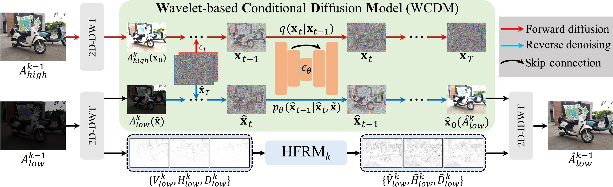

# Low-light Image Enhancement with Wavelet-based Diffusion Models [[Paper]](https://arxiv.org/pdf/2306.00306.pdf).
<h4 align="center">Anushree Chaudhary</center>

## Pipeline


## Dependencies
These dependencies should show no error for python=3.12.4. You may try to loosen the version constraints if compatibility issues arise.
```
pip install -r requirements.txt
````
There is a requirements.txt file in each of the new idea folders separately. The only difference is the lpips requirement in the DiffLL with LPIPS-based loss function.

## Download the raw training and evaluation dataset
### Paired dataset
You can find the dataset used here. Some modifications might have to be made according to your environment.
LOLv1 dataset: Chen Wei, Wenjing Wang, Wenhan Yang, and Jiaying Liu. "Deep Retinex Decomposition for Low-Light Enhancement", BMVC, 2018.  [[Google Drive]](https://drive.google.com/file/d/1It291IA2DVi8k2YZ-G0d1cGm301Tsi7r/view?usp=sharing)


## Pre-trained Model
Pre-trained models are available for download here: [[Google Drive]](https://drive.google.com/file/d/1UbUY4M8b4SMOOnmD_RcUAmWo09SuhXjt/view?usp=sharing)

## How can you train the model?
Ensure that the file paths are mentioned correctly in the configuration file.
```
python train.py  
```
In regards to LPIPS-based loss function, you may tune the parameter in the config file.

## How can you test the model?
Ensure that the path to the trained model is mentioned correctly in the evaluate.py file.
```
python evaluate.py
```

## Analysis
The PSNR (Peak Signal-to-Noise Ratio) and SSIM (Structural Similarity Index) metrics can be used to compare the outputs of the models at regular checkpoints (with training data as input) with the corresponding ground truth. The codes for these metrics are in the 'Analyis' folder. 
For metric analysis, you will need to maintain two folders for images corresponding to ground truth and model outputs. Ensure the path for the folders is mentioned correctly. Then, the codes may be run in a similar manner.
```
python psnr.py
```
```
python ssim.py
``` 


## Acknowledgement
The code is mainly adapted from the official work on this paper: [DiffLL](https://github.com/JianghaiSCU/Diffusion-Low-Light). I thank the authors for their contributions.
